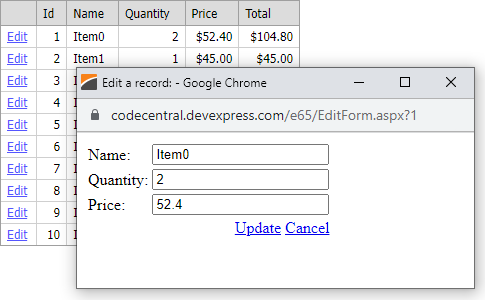

<!-- default badges list -->

<!-- default badges end -->

# Grid View for ASP.NET Web Forms - Edit row data in a new window
<!-- run online -->
**[[Run Online]](https://codecentral.devexpress.com/e65/)**
<!-- run online end -->

This example demonstrates how to edit a record in a new window (in a separate aspx page).

## Files to Review

* [Default.aspx](./CS/WebSite/Default.aspx) (VB: [Default.aspx](./VB/WebSite/Default.aspx))
* [EditForm.aspx](./CS/WebSite/EditForm.aspx) (VB: [EditForm.aspx](./VB/WebSite/EditForm.aspx))
* [EditForm.aspx.cs](./CS/WebSite/EditForm.aspx.cs) (VB: [EditForm.aspx.vb](./VB/WebSite/EditForm.aspx.vb))
